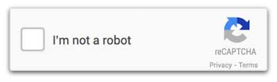

# mcbot - cognitive bots and mining github



## Summary

In the 80s there was [Zork](https://textadventures.co.uk/games/view/5zyoqrsugeopel3ffhz_vq/zork), [Zork](http://playdosgamesonline.com/zork-i.html), and [Zork](http://www.web-adventures.org/cgi-bin/webfrotz?s=ZorkDungeon).  
[Multi-User Dungeons](https://en.wikipedia.org/wiki/MUD) were a huge, addictive, virtual online world of text adventures.

Then [Doom](http://rome.ro/) came along and text gaming went away.

The first [text message](https://en.wikipedia.org/wiki/Text_messaging) was sent in 1992.   
Texting is the most widely used and frequently used app on smartphones.

A conversational agent (aka Dungeon Master) is a bot that understands, reacts, responds, empathizes, and tells a story.  

## Building a Bot
Start with the [Azure Bot Service - chatbot](https://azure.microsoft.com/en-ca/services/bot-service/)

If you have an Azure Subscription it's in the Azure Marketplace.

## Continuous Integration
When the Bot Service is setup, in the Develop tab, you can Enable Continuous Integration.  
Setup your [GitHub Repo](https://github.com/).  
Clone the repo locally with ``` git clone #my_git_repo_url#```  
Download and unzip the bot code to the cloned folder.  
Push the code with ```git push```  
Complete the 4 step-process.  Now you can't edit your code from the Azure Portal.

*Why didn't you just tell me you wanted to edit your code in the Azure Portal?*


I did some **git the hard way** due to a *fatal: refusing to merge unrelated histories* message.

```
md mcbot
git init
unzip #mybotcode.zip#
git add --all
git status
code .
git commit -m "initial commit"
git remote add origin https://github.com/asears/mcbot.git
REM I did this since I forgot to create the repo first.
git pull --allow-unrelated-histories origin master

```

## Ngrok
*If you're running the Bot Framework Emulator behind a firewall or other network boundary and want to connect to a bot hosted remotely, you will need to install and configure tunneling software.*
[Tunneling with Ngrok](https://github.com/Microsoft/BotFramework-Emulator/wiki/Tunneling-(ngrok)).  

[Download Ngrok](https://ngrok.com/) *”I want to expose a local server behind a NAT or firewall to the internet.”*

## LUIS
[Microsofts Language Understanding Intelligent Service (LUIS)](https://docs.botframework.com/en-us/node/builder/guides/understanding-natural-language/)

## Channels
For SMS, [voip.ms](voip.ms) provides cost-effective phone numbers.  
[Twilio](https://www.twilio.com/)

## Building Documentation
http://www.stack.nl/~dimitri/doxygen/
http://www.mcternan.me.uk/mscgen/
http://www.graphviz.org/

## App Manifest
This may need to go in the app manifest, if you get 500 server error.
```
<requestedExecutionLevel level="requireAdministrator" uiAccess="true" />
```

## Links
[Bot Directory](https://bots.botframework.com/)
https://www.kik.com/about/

*To learn how to debug Azure Bot Service bots, please visit [bf-docs-azure-debug](https://aka.ms/bf-docs-azure-debug)*  

*[Microsoft Bot Builder](https://github.com/Microsoft/BotBuilder/tree/master/CSharp) is a powerful framework for constructing bots that can handle both freeform interactions and more guided ones where the possibilities are explicitly shown to the user. It is easy to use and leverages C# to provide a natural way to write Bots.*